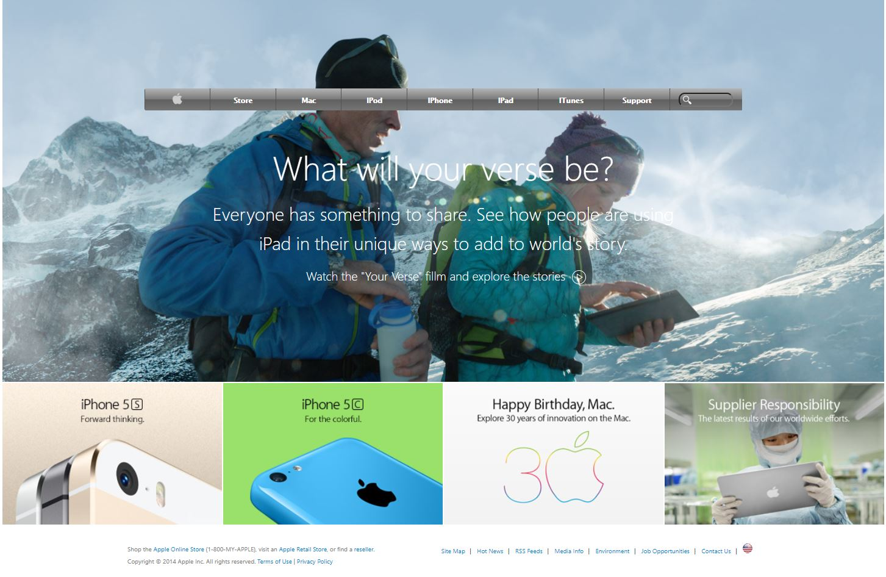

#  🧐 Old Apple page-project

> This is the fourth collaborative project from Microverse program, It's a mock-up of an Old Apple page, it's built on HTML and CSS3 languages.

## 🔧 Built With

- HTML and CSS3.
- Using background and gradients.
- Using StyleLinters.
- W3 HTML Validation Service.

## 🔴 Live Demo

[Live Demo Link](https://diazgio.github.io/Old-Apple-Page-project/)

## 🛠 Getting Started

To get a local copy up and running follow these simple example steps.

- Go to the main page of te repo.
- Press the "Code" button and get the repo link.
- Clone it using git.

## ✒️ Authors

👤 **Jurgen Clausen**

- Github: [@jurgen1c](https://github.com/jurgen1c)
- LinkenIn:[LinkenIn](https://www.linkedin.com/in/jurgen-clausen-2740061a9/)

👤 **Giordano Díaz**

- Github: [@diazgio](https://github.com/diazgio)
- Twitter: [@giordano_diaz](https://twitter.com/giordano_diaz)
- LinkenIn:[LinkenIn](www.linkedin.com/in/Giordano-Diaz)

## 🤝 Contributing

Contributions, issues and feature requests are welcome!

Feel free to check the [issues page](issues/).

## 📝 License

This project is [MIT](lic.url) licensed.
